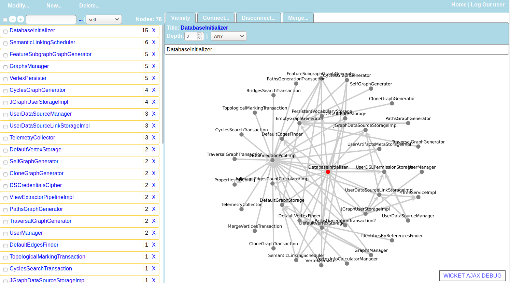

# About
Grapheus is a tool for _graphs exploration_. It provides _interactive navigation_ through your graphs and helps to _refine the data_ according specific criteria.

# Start Grapheus
You can start grapheus using small bash script employs docker-compose for environment orchestration. **No repository cloning is required**.
### Prerequisites for starting Grapheus
* Linux
* Bash
* Docker
* [Docker-Compose](https://docs.docker.com/compose/)

If you're installing docker for the first time you might need to perform officially recommended [post-installation steps](https://docs.docker.com/install/linux/linux-postinstall/).

### Download and run
Navigate to the [latest release](https://github.com/black32167/grapheus/releases/latest/) page and download **grapheus-runner-x.x.x.zip**.
After unpacking, go to the runner folder and just type (run w/o parameters to examine usage options):

```
grapheus-runner$ ./grapheus.sh start
```

After a while you'll be able to open web ui page in your browser ([http://127.0.0.1:8000/app/](http://127.0.0.1:8000/app/)):


# Working with repository
If you want to use development version or contribute, you will need to clone this repository.
### Prerequisites for working with the repository:
* All prerequisites from '[Prerequisites for starting Grapheus](#prerequisites-for-starting-grapheus)' section
* Git
* Maven 3

### Clone, build and run

```
$ git clone git@github.com:black32167/grapheus.git # For http use https://github.com/black32167/grapheus.git
$ cd grapheus
grapheus$ ./bin/build.sh current all # Will build maven artifacts, docker images and script runner. 
grapheus$ ./bin/grapheus.sh start    # Runs docker-compose infrastructure
```
